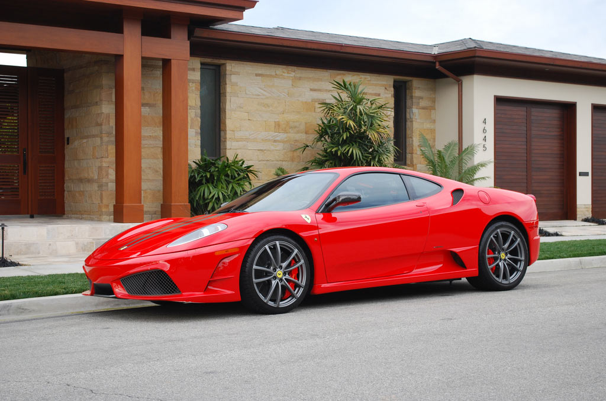
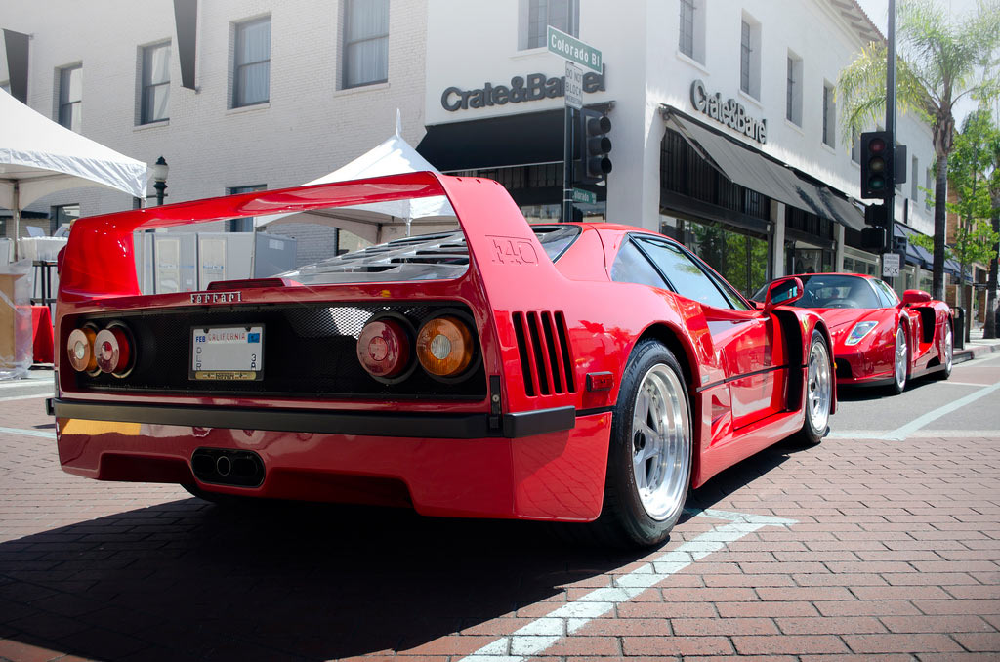

Gallerify
====================

Barebones animated picture galleries
--------------------------------------------

see http://gallerify-thead.rhcloud.com/ for live and moving example!

Just pure Javascript (no libraries/frameworks), CSS and HTML.

Goals of this project are

* cross browser support (Desktop: Works on IE8, FF, and Chrome. Mobile: is to be tested)
* no reliance on external libraries
* responsiveness
* visually appealing transitions/animations
* modularity

To get the slider working:
----------------------------------

html

    

        

        

        

        

        

            
            
            
        

    

js (along with including gallerify.js)

    var gal1 = new Gallery();

    gal1.buildSlider("main-car-nav-prev-arrow", "main-car-nav-next-arrow", "main-car-stage");

css

    #main-car {
        position: relative;
        clear: both;
        padding-bottom: 66.18%;
        /* derived from image height/width of 634/958px ratio of the pics I used */
    }

    .main-car-nav-stage-arrow {
        z-index: 10;
        height: 40px;
        width: 40px;
        position: absolute;
        margin: auto;
        top:0;
        bottom:0;
    }
    #main-car-nav-prev-arrow {
        background: white url("../img/left-arrow.png") no-repeat center;
        left: 0; 
    }

    #main-car-nav-next-arrow {
        background: white url("../img/right-arrow.png") no-repeat center;
        right: 0;
    }
    #main-car-stage > img {
        position: absolute;
        max-width: 100%;
    }

To get the projector working:
----------------------------------

html

    

        

            
            
            
        

        

            
            
            
        

    

js *note that a single Gallery instance can have both a projector and a slider

    var gal1 = new Gallery();
    gal1.buildProjector("second-gallery-stage", "second-gallery-nav", true);

css

    #second-gallery-wrapper {
        max-width: 554px;
        left: 0;
        right: 0;
        margin: auto;
    }

    #second-gallery-stage {
        position: relative;
        padding-bottom: 66.18%;
    }

    #second-gallery-nav {
        text-align: center;
    }

    #second-gallery-nav > img {
        width: 100px;
        height: 100px;
    }
    .projected {
        position: absolute;
        max-width: 100%;
    }

TODOS
--------------

* better interface for defining rates of transition
* better modularity (improved object oriented structure? extract animation algorithm into an engine?)
* further IE8+ compatible image transitions
